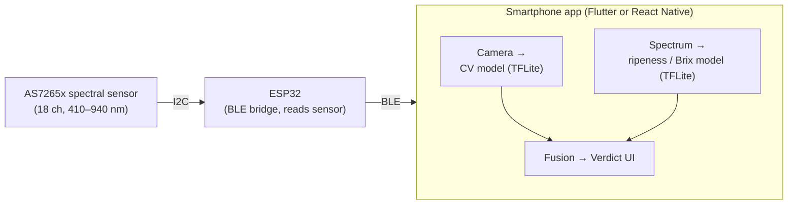

# Product Requirements Document — "OrchardEye"

**A dual-sensor crop health & quality scanner for Washington's 8th District**

| | |
|---|---|
| **Working product name** | OrchardEye *(placeholder — alternatives: CascadiaCrop, AppleIQ, FruitSense)* |
| **Author / Team** | [your name / team here] |
| **Target competition** | Congressional App Challenge — WA-08 (Rep. Kim Schrier) |
| **Home ZIP / District** | 98074 (Sammamish) → Washington's 8th Congressional District |
| **Version** | v0.1 (draft) |
| **Date** | June 2026 |
| **Status** | Draft for review |

> ⚠️ **Verify dates yourself:** confirm the current cycle's registration and submission deadlines at congressionalappchallenge.us. CAC typically opens registration in summer and closes submissions in early November. All milestones below are written relative to "Submission Day" so the schedule stays valid regardless of the exact date.

**Companion docs:** [AI pipeline](design/ai-pipeline.md) · [Feature list & variables](design/feature-list.md) · [Community & voice vision](vision/community-knowledge-and-voice.md) · [Build prompt](prompts/v1-build-prompt.md) · [Disease-loss research](research/disease-loss-statistics.md) · [Competitor research](research/market-competitor-analysis.md) · [Datasets](research/datasets.md)

---

## 1. Overview

OrchardEye is a smartphone app paired with a low-cost clip-on spectral sensor that gives small and specialty-crop growers two answers from a single scan of a fruit or leaf:

- **Is it diseased?** — the phone camera runs an on-device computer-vision model that classifies visible disease (or returns "healthy").
- **Is it good?** — a near-infrared (NIR) spectral sensor reads internal quality the camera physically cannot see (ripeness stage, sugar/Brix estimate), so growers know when to pick and which fruit makes premium grade.

The product is deliberately scoped around Washington tree fruit (apples, with cherries as an extension) because that is the dominant crop in WA-08's rural half and a stated legislative priority of the district's representative. The disease-detection pipeline is prototyped on tomato — where large public datasets exist — then transferred to apple, which is both a sound engineering approach and a clear demo story.

---

## 2. Problem statement & district relevance

### The problem
Judging fruit ripeness and catching disease early are traditionally done by eye or by destructive lab tests (cutting fruit open to measure sugar). That means:
- Growers pick too early (low sugar, poor flavor, rejected loads) or too late (overripe, post-harvest loss).
- Disease is caught late, after it has spread.
- The objective tools that solve this (lab NIR spectrometers, agronomist visits) cost thousands of dollars — out of reach for small growers, community orchards, and student/hobby farmers.

### Why this matters specifically to WA-08
Washington's 8th District is split between the Seattle Eastside suburbs (including Sammamish/98074) and the tree-fruit heartland across the Cascades — Wenatchee, Chelan, and Leavenworth. Tree fruit (apples, cherries, pears) is the economic backbone of that rural half, and Washington State University's Tree Fruit Research and Extension Center in Wenatchee sits inside the district.

This connects directly to the representative's documented priorities:
- **Specialty crops** (apples, cherries, hops) are an explicit agricultural focus of the office.
- **Climate-smart / conservation agriculture** — reducing post-harvest waste and optimizing harvest timing is a concrete sustainability win.
- **Supporting small and local farmers / food access** — a ~$100 tool democratizes technology that normally costs thousands, helping small growers compete.
- **Health & nutrition** (the representative's medical background) — better quality and safer produce ties to child nutrition and food-quality themes.

> **One-sentence pitch for judges:** "OrchardEye puts a $3,000 lab capability into a $100 phone attachment so the small apple and cherry growers who power my district can pick at peak quality and catch disease early — turning waste into income."

---

## 3. Goals & non-goals

### Goals (v1)
- Classify visible disease on a fruit/leaf image, including a "healthy / no disease" result.
- Estimate ripeness stage and a sugar (Brix) value from a single NIR scan.
- Fuse both into one plain-language verdict in the app.
- Run entirely on consumer-grade, sub-$130 hardware a student can buy.
- Work offline in the field (on-device inference, no signal required for a scan).

### Non-goals (v1 — explicitly out of scope)
- Deep internal chemistry that requires expensive InGaAs sensors above 1000 nm (e.g., water bands at 1450 nm).
- A fully phone-integrated NIR chip (that hardware exists only as an OEM reference design today).
- Pest identification, yield forecasting, or multi-acre mapping (listed as stretch goals).
- Medical, regulatory, or food-safety certification claims.

---

## 4. Success metrics

| Metric | Target (v1) | Notes |
|---|---|---|
| Disease classification accuracy (public test set) | ≥ 90% | On held-out PlantVillage split |
| Disease accuracy (your own field photos) | ≥ 75% | Real-world domain gap is expected and honest to report |
| Ripeness classification (3–4 classes) | ≥ 85% | Literature shows ~96% achievable with AS7265x + SVM |
| Brix regression | R² ≥ 0.80, RMSE ≈ 1 °Brix | Calibrated per variety |
| Single-scan latency (capture → verdict) | < 3 s on-device | TensorFlow Lite quantized model |
| Hardware bill of materials | < $130 | See §8 |
| Field usability test | 5+ outside testers complete a scan unaided | Counts toward "real-world impact" in judging |

---

## 5. Target users

- **Primary:** small / specialty-crop growers in central WA who can't justify lab equipment.
- **Secondary:** community orchards, farm stands, u-pick operations, school/4-H ag programs.
- **Tertiary:** home gardeners and consumers choosing ripe fruit at market.

**Persona — "Maria, 5-acre apple grower near Wenatchee":** wants to know which blocks are ready to pick this week and whether spots on her leaves are scab or harmless. Can't afford an agronomist on retainer. Has a phone and a tight budget.

---

## 6. Feature requirements (functional)

> Full spec with output variables and acceptance criteria: [`design/feature-list.md`](design/feature-list.md).

**F1 — Camera disease scan**
- F1.1 Capture or import a photo of a leaf/fruit.
- F1.2 On-device CV model returns a label + confidence (e.g., "Apple scab — 92%") or "Healthy — no disease detected."
- F1.3 Show the top-2 alternatives if confidence is below a threshold.
- F1.4 Plain-language explanation + a "what to do next" tip per disease class.

**F2 — NIR quality scan**
- F2.1 Pair with the spectral sensor over Bluetooth Low Energy (BLE).
- F2.2 Trigger an 18-channel reflectance reading (410–940 nm) with the sensor's onboard LEDs.
- F2.3 Run the spectral model → ripeness class + estimated Brix.
- F2.4 Prompt to average 3 readings for stability; show a quality/confidence indicator.

**F3 — Fused verdict**
- F3.1 Combine F1 + F2 into one screen: disease status and quality grade.
- F3.2 Verdict spectrum: Diseased → Healthy but not ready → Healthy & premium.
- F3.3 Actionable recommendation (e.g., "Healthy, ~11 °Brix, ripe — pick now").

**F4 — History & export**
- F4.1 Save scans (timestamp, GPS optional, image, spectrum, results) locally.
- F4.2 Export CSV for a grower's own records.
- F4.3 *(Stretch)* Map scans by block/location.

**F5 — Onboarding & calibration**
- F5.1 First-run pairing wizard for the sensor.
- F5.2 Variety selector (calibration is variety-specific — see §9).
- F5.3 Optional "white reference" calibration step before a session.

---

## 7. Technical architecture

- **App framework:** Flutter or React Native (cross-platform, single codebase).
- **Disease model:** lightweight CNN (e.g., MobileNetV2 / EfficientNet-Lite) fine-tuned on PlantVillage, exported to TensorFlow Lite for on-device inference.
- **Quality model:** small classifier (SVM or shallow MLP) for ripeness + a regressor (PLS or shallow ANN) for Brix, trained on your own spectral samples. Small enough to run on-device or in-app.
- **Fusion:** start with decision-level fusion (run both models, combine outputs with rules). Stretch: feature-level fusion (concatenate image embeddings + spectral features into one model) — a strong novelty point for judges.
- **Connectivity:** BLE for the sensor; the app works offline for scanning. Optional cloud sync later.

> Detailed pipeline (quality gate, preprocessing, quantized models, fusion, trends, community loop): [`design/ai-pipeline.md`](design/ai-pipeline.md).

---

## 8. Hardware — bill of materials

| Item | Purpose | Est. cost (USD) |
|---|---|---|
| SparkFun AS7265x "Triad" spectral sensor (18 ch, 410–940 nm) | NIR/Vis quality reading | ~$65 |
| ESP32 dev board | Reads sensor over I2C, streams over BLE | ~$12 |
| Qwiic cable + misc wiring | Connect sensor to ESP32 | ~$6 |
| LiPo battery + charger (or USB power bank) | Field power | ~$12 |
| Handheld Brix refractometer (0–32%) | Ground-truth for training the Brix model | ~$18 |
| 3D-printed dark shroud / housing | Block ambient light, fix scan distance | ~$5 (or free at a makerspace) |
| **Total** | | **~$118** |

> **Sensor note:** the AS7265x is a silicon Vis-NIR sensor topping out near 940 nm. That range is great for ripeness, chlorophyll, and surface chemistry. **Do not** claim deep sugar/water bands (1450 nm, 2100 nm) — those need a far pricier InGaAs sensor and are out of scope. Keeping claims inside what 410–940 nm can really do is part of doing this rigorously.

---

## 9. Data & ML plan

### 9.1 Disease (computer vision)
- **Source data:** PlantVillage — has apple classes (apple scab, black rot, cedar apple rust, healthy) and a large tomato set for prototyping.
- **Approach:** prototype the full pipeline on tomato (abundant data), then fine-tune/transfer to apple.
- **Reality check:** PlantVillage images are clean/lab-style; real field photos perform worse. Collect ~100–300 of your own real apple-leaf/fruit photos to fine-tune and to report honest real-world numbers. The domain gap is a feature of your write-up, not a flaw — judges respect that you measured it.

> Dataset catalog (incl. the Mendeley set, PlantVillage, PlantDoc, Plant Pathology 2020/2021, cherry & spectral gaps): [`research/datasets.md`](research/datasets.md).

### 9.2 Quality (NIR) — collection protocol
Because there is no large public spectral dataset for your exact setup, you build your own calibration set:
- Collect 50+ fruit per variety spanning unripe → overripe.
- For each fruit: take 3 averaged NIR scans through the dark shroud at a fixed distance.
- Immediately measure ground-truth Brix with the refractometer (this is destructive — cut/juice the fruit).
- Record: 18 channel values, Brix, a ripeness label, variety, date.
- Train ripeness classifier + Brix regressor; validate with leave-one-out or a held-out split.

> **Calibration is variety-specific.** A model tuned on one apple cultivar won't transfer cleanly to another — note this as a known limitation and a future-work item (transfer learning across varieties).

---

## 10. UX / screen flow

1. **Home** → big "New Scan" button; sensor connection status.
2. **Scan step 1 — Camera:** capture leaf/fruit → instant disease result card.
3. **Scan step 2 — NIR:** "Hold sensor to fruit, tap Scan" → spectrum captured → ripeness/Brix card.
4. **Verdict screen:** combined result, color-coded (red = diseased, amber = healthy/not ready, green = healthy/premium) + one-line recommendation.
5. **History:** list + detail + CSV export.
6. **Settings:** variety selector, calibration, sensor pairing.

> Design for outdoors: large tap targets, high-contrast text, works one-handed, no reliance on signal.

---

## 11. Milestones & timeline

*(Weeks counted backward from Submission Day. Compress if you have less time.)*

| Phase | Window | Deliverable |
|---|---|---|
| 0. Setup | Sub−10 wks | Repo, app skeleton, dataset downloaded, hardware ordered |
| 1. Disease MVP | Sub−9 to −7 wks | TFLite tomato model running on-device in the app |
| 2. Apple transfer | Sub−7 to −6 wks | Apple disease classes + "healthy" working |
| 3. Sensor bridge | Sub−6 to −5 wks | ESP32 reads AS7265x, streams to app over BLE |
| 4. NIR data + model | Sub−5 to −3 wks | Calibration set collected, ripeness/Brix model trained |
| 5. Fusion + UX | Sub−3 to −2 wks | Single verdict screen, full flow polished |
| 6. Field test | Sub−2 to −1 wk | 5+ outside testers, fix top issues |
| 7. Demo + writeup | Sub−1 wk | Demo video, README, submission text, source link |

---

## 12. Risks & mitigations

| Risk | Likelihood | Mitigation |
|---|---|---|
| Real-world disease accuracy drops vs. PlantVillage | High | Fine-tune on own photos; report both numbers honestly |
| NIR data collection takes longer than expected | Med | Start collecting in Phase 1; tomato is a fast fallback crop |
| Sensor/BLE integration bugs | Med | Build §7 bridge early (Phase 3); test with a static dataset first |
| "Tomato disease classifier is overdone" | Med | The disease+NIR fusion + apple/WA framing is the novelty |
| Overclaiming NIR capability | Med | Keep claims within 410–940 nm; state limits explicitly |
| Scope creep before deadline | High | Lock v1 to §3 goals; everything else is a stretch goal |

---

## 13. Congressional App Challenge — judging & alignment

CAC judges typically weigh quality of the idea, technical implementation/complexity, and demonstrated impact. Map your work to each:
- **Idea quality:** a single affordable device answering two questions (disease + internal quality) that normally need separate, expensive tools.
- **Technical complexity:** on-device CV + a custom-collected spectral dataset + sensor/BLE hardware integration + sensor-fusion. This is meaningfully harder than a single-model app — lean into it in the write-up.
- **Impact / community relevance (your differentiator):** tie it explicitly to WA-08's tree-fruit economy and the representative's stated priorities (specialty crops, climate-smart/conservation agriculture, supporting small and local farmers, food quality/nutrition). Reference WSU's Wenatchee Tree Fruit Research and Extension Center as the in-district institution your tool serves.

---

## 14. Stretch goals

- Feature-level sensor fusion (one model over image + spectral features).
- Geo-tagged scan map for tracking blocks/orchards over a season.
- Cherry and pear calibration (other major WA tree fruit).
- Pre-symptomatic stress detection (NIR signal before visible disease).
- Cloud dashboard for a grower's season-long trends.

---

## Appendix A — WA-08 district fact sheet

- ZIP 98074 (Sammamish) is in Washington's 8th Congressional District.
- The district spans Seattle's Eastside suburbs (Sammamish, Issaquah, Maple Valley) and central WA across the Cascades (Wenatchee, Leavenworth, Chelan, Ellensburg).
- The rural half is core tree-fruit country; apples, cherries, and hops are leading specialty crops.
- WSU Tree Fruit Research and Extension Center (Wenatchee) is located within the district.
- Representative: Kim Schrier (D), lives in Sammamish; first pediatrician in Congress; serves on the House Energy and Commerce Committee with a strong record on agriculture/specialty crops, conservation, and rural issues.

> Verify current district boundaries, representative, and committee assignments before submission — these can change between cycles.

## Appendix B — Talking points for your demo video / submission

- Open with the district: *"I live in WA-08, where apples and cherries are the economic engine across the mountains."*
- State the gap: lab-grade ripeness/disease tools cost thousands; small growers go without.
- Show one scan → two answers (disease + quality) in under 3 seconds.
- Name the impact: less waste, better grade, more income for small farmers — and a tool a student built for ~$100.
- Close on alignment: *"This is the kind of affordable, climate-smart tool for specialty-crop growers that my district depends on."*
- Keep every claim inside what you actually measured and what 410–940 nm sensing can really do — rigor and honesty read as strength to judges.
