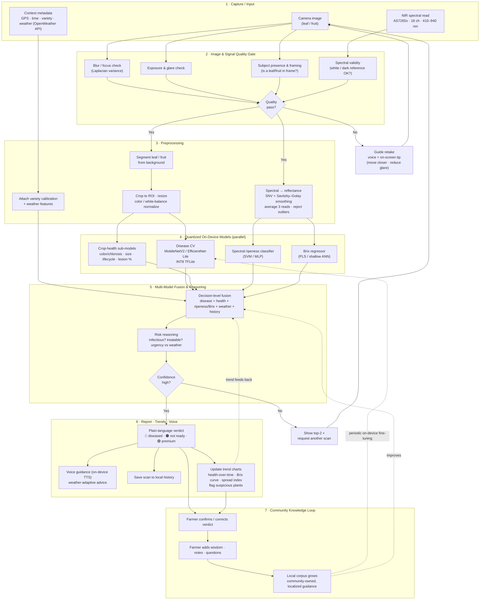

# OrchardEye — AI Pipeline & Data Flow

> **Status:** design draft (v0.1) · **Owner:** [team]
> This document expands the one-line concept *"AI quality-checks the images → AI preprocesses → AI uses quantized models → AI does fusion of all models for the final report + updates the trends & chart"* into a full, buildable pipeline.

The pipeline is **dual-sensor** (phone camera + clip-on NIR spectral sensor) and runs **on-device first** so a scan works offline in the field. Every stage has a clear input, an output, a failure path, and a place where the *community-knowledge* and *voice-guidance* layers plug in.

---

## 1. The pipeline at a glance

> If the diagram does not render in your viewer, GitHub renders Mermaid natively — view this file on GitHub, or paste the block into <https://mermaid.live>.

---

## 2. Stage-by-stage detail

### Stage 1 — Capture / Input
Three inputs are gathered for a single "scan event":

| Input | Source | Notes |
|---|---|---|
| **Image** | Phone camera (or imported photo) | One frame of a leaf or fruit. |
| **Spectrum** | AS7265x via ESP32 over BLE | 18 reflectance channels, 410–940 nm, sensor's own LEDs. |
| **Metadata** | Phone + APIs | GPS (optional), timestamp, user-selected **variety**, and **weather** pulled from a free weather API (e.g., OpenWeatherMap / Open-Meteo): temperature, humidity, recent rain — proxies for disease pressure and leaf wetness. |

A scan event ties all three together with one ID so history, trends, and the community loop stay coherent.

### Stage 2 — Image & Signal Quality Gate *("AI quality-checks the images")*
Garbage in → garbage out. Before spending compute on inference, a cheap gate decides whether the capture is usable. This is what the brief calls *"AI quality checks the images."*

- **Blur / focus** — variance-of-Laplacian threshold; reject motion blur.
- **Exposure & glare** — histogram + specular-highlight check; reject washed-out or too-dark frames (common outdoors).
- **Subject presence & framing** — a tiny detector / saliency check answers *"is there actually a leaf or fruit, and does it fill enough of the frame?"* Rejects photos of the sky, ground, a hand, etc.
- **Spectral validity** — confirm a valid white/dark reference exists for the session and the reading isn't saturated or near-zero (sensor not touching fruit).

**Decision:** if any check fails, the app does **not** silently guess. It routes to **Guide Retake** with a specific, voice-assisted instruction ("Move a little closer," "Too much glare — angle away from the sun," "Hold steady"). This single gate is the biggest real-world accuracy lever, because lab-trained disease models degrade sharply on bad field photos.

### Stage 3 — Preprocessing *("AI preprocesses")*
Two parallel tracks plus a metadata track:

**Image track**
1. **Segment** the leaf/fruit from the background (lightweight segmentation or color/grabcut) so the model sees the subject, not the orchard floor.
2. **Crop to ROI, resize** to the model's input size, and **normalize color / white-balance** so lighting differences (cloud vs. sun) don't masquerade as disease.

**Spectral track**
3. Convert raw counts to **reflectance** using the dark/white reference, then **smooth** (Savitzky–Golay) and **normalize** (SNV / first-derivative) to remove distance and intensity effects. **Average 3 reads** and reject outliers for stability.

**Metadata track**
4. Attach the **variety-specific calibration profile** (Brix/ripeness models are variety-specific — see PRD §9) and the **weather features** so the fusion stage can reason about risk.

### Stage 4 — Quantized On-Device Models *("AI uses quantized models")*
All inference runs on-device with **INT8-quantized** models so it is fast (<3 s target) and works offline. Four model heads run, conceptually in parallel:

| Head | Model | Output |
|---|---|---|
| **M1 · Disease** | MobileNetV2 / EfficientNet-Lite, INT8 TFLite | Disease class + confidence, or "healthy." |
| **M2 · Crop health** | Lightweight sub-models / CV heuristics | Color/chlorosis index, size & lifecycle estimate, lesion-area %. Feeds the **Crop Health Score**. |
| **M3 · Ripeness** | SVM / shallow MLP on spectrum | Ripeness class (e.g., unripe / ripe / overripe). |
| **M4 · Brix** | PLS / shallow ANN on spectrum | Estimated °Brix (sugar). |

Each head emits a **calibrated confidence** (e.g., temperature-scaled) so the fusion stage can trust or distrust it. Quantization detail and target sizes live in [`docs/design/feature-list.md`](feature-list.md) and the build prompt.

### Stage 5 — Multi-Model Fusion & Reasoning *("AI does fusion of all models for the final report")*
This is the novelty point for judges: instead of one model answering one question, OrchardEye **fuses** several signals into one verdict.

- **F1 · Decision-level fusion** combines disease status + crop-health score + ripeness/Brix + weather context + this plant's **historical trend** into a single state on the verdict spectrum:
  `Diseased → Healthy but not ready → Healthy & premium`.
- **F2 · Risk reasoning** answers the grower's real questions: *Is it infectious or cosmetic? Is it treatable? How urgent is it given the weather?* (e.g., warm + humid + a scab-like lesion ⇒ "act now, conditions favor spread").
- **F-decision** is a **confidence gate**: if the fused confidence is low (models disagree, borderline lesion), the app shows the **top-2** possibilities and asks for **another scan / second angle** rather than over-claiming.

> **Roadmap:** start with rule-based decision-level fusion (transparent, debuggable). Stretch goal = **feature-level fusion** — concatenate image embeddings + spectral features into one model — which is a strong differentiator but harder to validate.

### Stage 6 — Report · Trends · Voice *("final report + updating the trends & chart")*
- **R1 · Verdict** — one color-coded, plain-language card (🔴 / 🟠 / 🟢) with a one-line "what to do next."
- **R2 · Voice guidance** — the verdict and recommendation are spoken via **on-device TTS**, **adapted to weather** (e.g., "Rain expected tonight — if you spray, do it this afternoon"). See [`docs/vision/community-knowledge-and-voice.md`](../vision/community-knowledge-and-voice.md).
- **R3 · History** — persist the full scan (image, spectrum, results, GPS, weather) locally; CSV export for the grower's own records.
- **R4 · Trends & charts** — update per-plant / per-block time series: **health-over-time**, **Brix curve approaching harvest**, and a **spread index**. A plant trending worse over successive scans is automatically **flagged as suspicious**, which feeds back into the risk reasoning (is this spreading = infectious, or static = cosmetic/treatable?).

### Stage 7 — Community Knowledge Loop *(the "matured / overall perspective" layer)*
The loop that turns a scanner into a **community-owned advisor**:
- **C1** — the farmer can **confirm or correct** the verdict ("this was actually X").
- **C2** — the farmer adds **local wisdom, notes, and questions** (what worked, what didn't, local names for problems).
- **C3** — these grow a **local corpus** that improves localized guidance and, periodically, **fine-tunes the on-device model** and **re-weights fusion** for this community's varieties and conditions.

This is detailed in [`docs/vision/community-knowledge-and-voice.md`](../vision/community-knowledge-and-voice.md).

---

## 3. Feedback loops (why this is a *pipeline*, not a line)

| Loop | Trigger | Effect |
|---|---|---|
| **Retake loop** | Quality gate fails | User re-captures with specific guidance — protects real-world accuracy. |
| **Rescan loop** | Fusion confidence low | Ask for a second angle / 3-read average instead of guessing. |
| **Trend loop** | New scan of a known plant | Trend history feeds back into risk reasoning (infectious vs. static). |
| **Community loop** | Farmer correction / contribution | Periodic on-device fine-tuning + fusion re-weighting for local conditions. |

---

## 4. What runs where

| Concern | On-device (offline) | Cloud / online (optional) |
|---|---|---|
| Image quality gate | ✅ | — |
| Preprocessing | ✅ | — |
| Disease + health + spectral inference | ✅ (quantized) | — |
| Fusion + verdict + voice | ✅ | — |
| Weather features | cached last value | ✅ live fetch when online |
| History & CSV | ✅ local | optional sync (stretch) |
| Community corpus aggregation | local first | optional federated/curated sync |

**Design rule:** a scan must always complete and produce a verdict **with no signal**. Anything cloud-based is an enhancement, never a dependency.

---

## 5. Open questions / to validate
- Best lightweight on-device **segmentation** approach that fits the <3 s / low-RAM budget.
- Whether crop-health sub-models (M2) should be separate heads or derived from the disease backbone's features.
- Calibrating cross-variety Brix without collecting a full dataset per cultivar (transfer learning — stretch).
- Privacy & ownership model for the community corpus (see vision doc).
